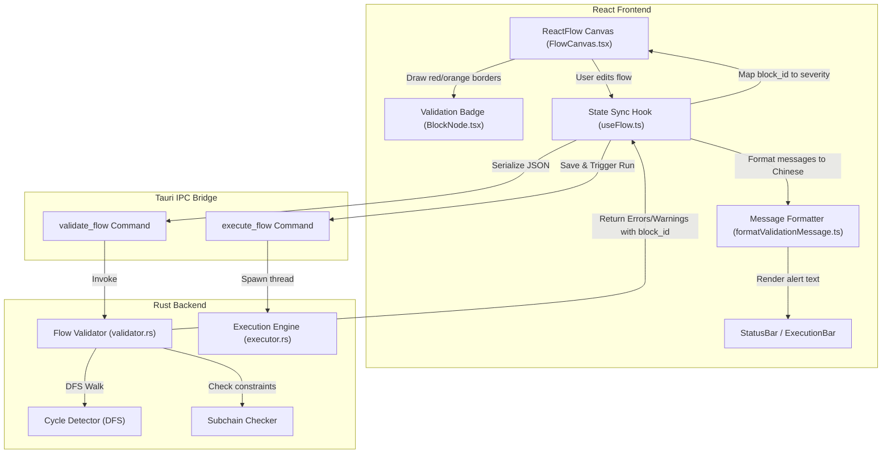

# Visual Automation Designer - Optimization & Roadmap

This document outlines the architecture, recent achievements in Flow Validation and Localization, and details the technical roadmap for the next development phases of the `visual-automation-designer`.

---

## 🗺️ System Architecture & Validation Flow

The visual automation designer maintains synchronization between a highly interactive ReactFlow canvas and a high-performance Rust execution engine via Tauri IPC. Here is how structural validation, error localization, and flow execution are orchestrated:

---

## 🎉 Recent Achievements (Validation & Localization)

We have successfully optimized the flow validation workflow, shifting runtime errors into early visual validation warnings and improving user-experience with precise node localization and friendly Chinese guidelines.

### 1. Precise Node-Level Localization
Previously, validation errors (such as cycles and subchain violations) were displayed as global errors without pinpointing the offending blocks. The Rust validator now embeds the exact `block_id` for structural violations:
* **`CYCLE_DETECTED`**: Traces the starting point of the infinite loop.
* **`DUPLICATE_CONNECTION`**: Attaches the originating block ID of duplicate links.
* **`CONDITION_BRANCH_SUBCHAIN_UNSUPPORTED`**: Pinpoints the nested branch node violating the single-node execution rule.
* **`LOOP_SUBCHAIN_UNSUPPORTED`**: Targets the child node causing an illegal boundary-crossing sequence inside a loop.

### 2. Comprehensive Chinese Translation & Remediation Guidelines
Technical validation codes are now mapped to clear, step-by-step resolution paths in the frontend (`formatValidationMessage.ts`):

| Error/Warning Code | Severity | Description (Chinese) | Actionable Resolution Path (Chinese) |
| :--- | :--- | :--- | :--- |
| **`CYCLE_DETECTED`** | Error | 检测到流程中存在循环连接（回路）。 | 积木块不能形成首尾相连的环路。请删除导致环路的连线，避免执行时陷入死循环。 |
| **`NO_ENTRY`** | Warning | 当前流程未设置启动入口。 | 请右键任意一个节点并选择“设为入口”，以指定自动化执行的起点。 |
| **`EMPTY_CONDITION_BRANCHES`** | Error | 条件判断的“真”与“假”分支均为空。 | 请从条件块底部的“真/假”出口拉出连线，连接至对应要执行的积木块。 |
| **`ORPHAN_BLOCK`** | Warning | 该积木块处于孤立状态，未连接至流程。 | 请用连线将其接入主流程，或者删除不需要的节点。 |
| **`INVALID_CLICK_COUNT`** | Error | 点击次数必须至少为 1 次。 | 请在右侧配置面板中将点击次数修改为大于等于 1 的数值。 |
| **`ZERO_WAIT_TIME`** | Error | 等待时间不能为 0ms。 | 请设置一个大于 0 的有效等待毫秒数。 |
| **`ZERO_LOOP_COUNT`** | Error | 循环次数必须至少为 1 次。 | 请在右侧配置面板中将循环次数修改为大于等于 1 的数值。 |
| **`TIMEOUT_OUT_OF_RANGE`** | Error | 等待超时时间超出合理范围。 | 超时时间应设定在 100ms 到 60000ms（1分钟）之间。 |
| **`EMPTY_INPUT_TEXT`** | Error | 输入文本内容不能为空。 | 请在右侧配置面板输入您希望自动键入的文本内容。 |
| **`INVALID_IMAGE_REFERENCE`** | Error | 未配置有效的图片引用。 | 请在配置区为该步骤重新捕获或选择一张目标图片。 |

---

## 🚀 Optimization Roadmap

To guide the project toward a bulletproof, production-grade release, we have structured the next actions into three main tracks.

### Track A: Desktop Hardening & Screen/DPI Correctness
Desktop automation requires high accuracy when mapping coordinate-based operations (like mouse clicks and image matching) to physical displays.

> [!WARNING]
> High DPI scaling and multi-monitor configurations are the most common source of coordinate misalignment in Tauri-based automation systems.

* **Multi-Monitor Coordinate Offsets**:
  * Implement physical-to-logical display coordinate translation on the Rust side (`src-tauri/src/platform/screen.rs`).
  * Add support for virtual desktop coordinates, accommodating secondary monitors positioned with negative Cartesian coordinate values.
* **Mixed-DPI Scaling Correction**:
  * Correct scale factors dynamically using Tauri's monitor query APIs (`tauri::window::Monitor` scale factors).
  * Automatically adjust click coordinates using target display DPI coefficients.
* **Stop Latency Verification**:
  * Audit long-running loops (e.g., waiting for images or waiting for times) to ensure the tokio `watch::Receiver` stop channel is checked frequently.
  * Keep the stop latency below **100ms** even when automation is waiting on system events.

---

### Track B: Flow Canvas UX & Validation Refinements
Enhance visual feedback and interactive controls on the canvas to ensure building automation feels natural and predictable.

* **Clear Entry Block Action**:
  * Assess adding a "Clear Entry" action inside the block node context menu.
  * Provide visual warnings if the entry block is deleted or orphaned, suggesting users to reset a new entry node.
* **Warning vs. Error Separation**:
  * Differentiate the visual style of Warnings (orange icons, subtle borders) from Errors (red badges, glowing outline borders) on the canvas.
  * Ensure that while **Errors** completely block the "Run" trigger, **Warnings** only raise user notifications without preventing execution.
* **Interactive Node Focus**:
  * Ensure clicking a structural validation item in the bottom status panel automatically centers the view on the offending block node using ReactFlow's animation APIs.

---

### Track C: Resilience & Automated CI Checks
Improve the overall stability of the codebase and release cycles.

* **Image Library Resilience**:
  * Implement recovery code in the Rust Image Library manager to restore corrupted JSON metadata (`metadata.json`).
  * Introduce an auto-clean task that cleans up orphaned temp files generated from clipboard captures.
* **Version Consistency Validator**:
  * Create a pre-commit or pre-release script (e.g., `scripts/verify-versions.js`) to automatically verify that:
    1. `package.json` version
    2. `src-tauri/Cargo.toml` package version
    3. `src-tauri/tauri.conf.json` product version
    always match perfectly before a build is allowed.
* **Expanded Integration Testing**:
  * Write additional execution tests for complex nesting patterns (e.g., condition blocks inside loops, loops inside conditions) in `tests/commands_integration_test.rs`.

---

## 📈 Release Checklist (`v0.4.7`)

Before packaging the next release, complete the following quality control steps:

1. [ ] **Verify Versions**: Run `npm run verify-versions` (to be created) or manually match versions in `package.json`, `Cargo.toml`, and `tauri.conf.json`.
2. [ ] **Lint Suite**: Ensure `npm run lint` yields zero warnings or errors.
3. [ ] **Test Suite (Frontend)**: Run `npm run test` (all 206 tests must pass).
4. [ ] **Test Suite (Backend)**: Run `cargo test` (all 184 tests must pass).
5. [ ] **Desktop Build**: Validate the packaging script by running `npm run tauri build`.
6. [ ] **Clean Boot Test**: Verify that launching the packaged executable on a clean environment successfully initializes the default database and directories.
